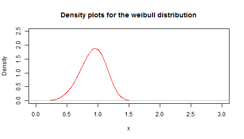
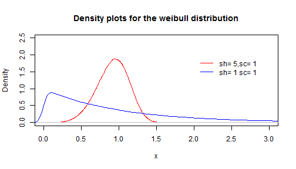

## Purpose  

  
- The app plots density curves for the Weibull distribution with different parameters for shape and scale that can be tested by the user.  

- The generated curve is always plotted together with the original plot (with shape=5 and scale=1) for comparison

- A random weibull distribution with 1000000 points is generated and the density is then plotted. The density is similar to a histogram, but drawn as a line instead of frequency bars.  

- A definition of the Weibull distribution can be found at [Wikipedia](http://en.wikipedia.org/wiki/Weibull_distribution)

---

## The main plot is generated with the R code below  


```r
dd0 <- rweibull(1000000,shape = 5, scale = 1)
plot(density(dd0)
     ,main="Density plots for the weibull distribution"
     ,xlab="x",xlim=c(0,3),ylim=c(0,2.5),col="red")
```

 

---

## And a line with user inputs is then plotted in the same chart  


```r
inshape <- 1#input$shape
inscale <- 1#input$scale
## repeating line from previous slide
plot(density(dd0),main="Density plots for the weibull distribution",xlab="x",xlim=c(0,3),ylim=c(0,2.5),col="red")
dd <- rweibull(1000000,shape = inshape, scale = inscale)
lines(density(dd),col="blue")
legend(2,2,c("sh= 5,sc= 1",paste("sh=",inshape,"sc=",inscale)),col=c("red","blue"),lty=1,box.lty=0)
```

 

---

## The App  
  
- The app can be accessed at this address: [plotWeibull](https://ericosantos.shinyapps.io/plotWeibull/)  

- And the code can be found at: [Github](https://github.com/ericosantos/projDataProd)
